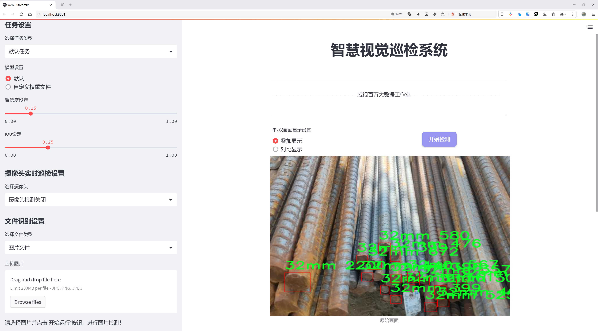
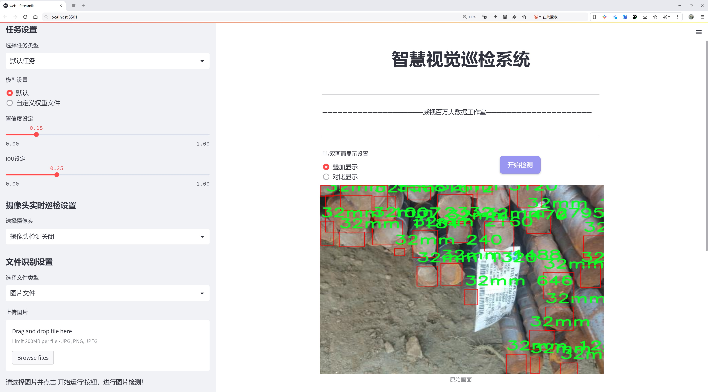
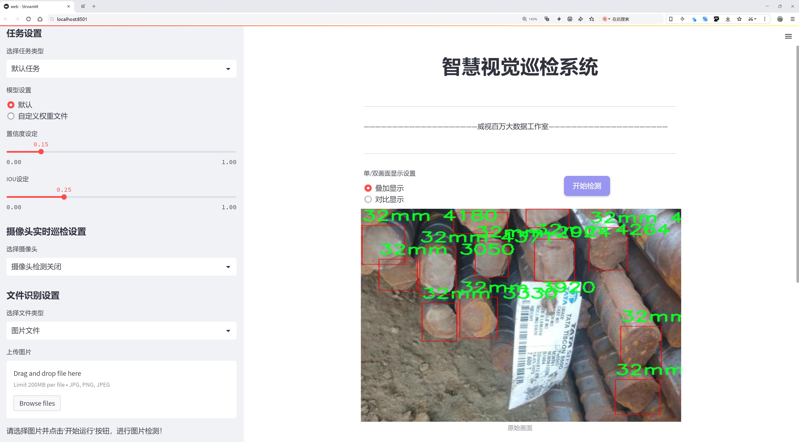
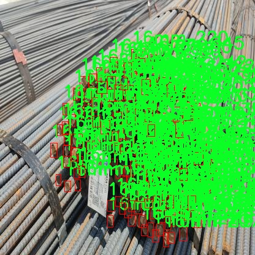
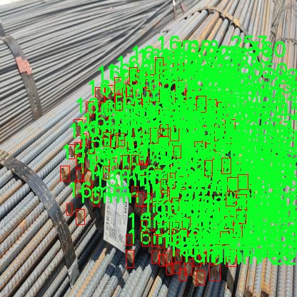
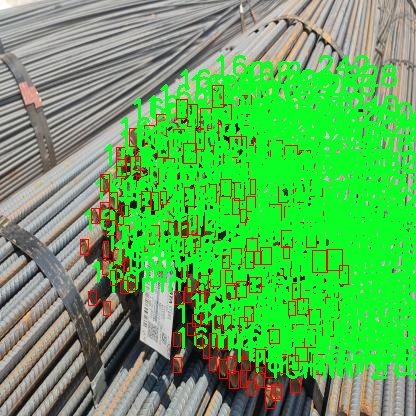
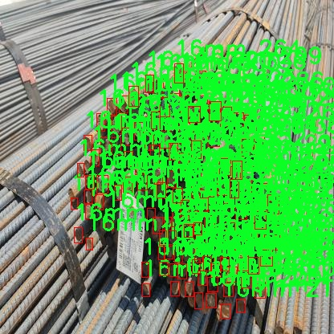
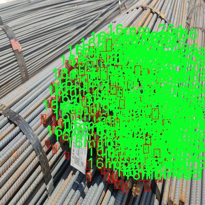

# 钢筋类型检测系统源码分享
 # [一条龙教学YOLOV8标注好的数据集一键训练_70+全套改进创新点发刊_Web前端展示]

### 1.研究背景与意义

项目参考[AAAI Association for the Advancement of Artificial Intelligence](https://gitee.com/qunmasj/projects)

项目来源[AACV Association for the Advancement of Computer Vision](https://github.com/qunshansj/good)

研究背景与意义

随着建筑行业的快速发展，钢筋作为混凝土结构的重要组成部分，其类型的准确识别与分类对于工程质量的保障、施工安全的维护以及资源的合理利用具有重要意义。传统的钢筋识别方法多依赖人工目测和简单的测量工具，这不仅效率低下，而且容易受到人为因素的影响，导致识别结果的不准确。因此，基于计算机视觉和深度学习技术的自动化钢筋类型识别系统应运而生，成为提高建筑行业生产效率和安全性的重要手段。

近年来，YOLO（You Only Look Once）系列目标检测算法因其高效性和准确性而广泛应用于各类物体识别任务中。YOLOv8作为该系列的最新版本，结合了更为先进的网络结构和优化算法，具备了更强的特征提取能力和实时检测性能。在此背景下，基于改进YOLOv8的钢筋类型识别系统的研究显得尤为重要。通过对钢筋图像数据集的深度学习训练，能够实现对不同类型钢筋（16mm、32mm、8mm）的快速、准确识别，为建筑施工提供有力支持。

本研究的数据集包含2327张钢筋图像，涵盖了三种不同直径的钢筋类型。这一数据集的构建为模型的训练和测试提供了丰富的样本，确保了模型在实际应用中的泛化能力。通过对这些图像进行标注和分类，研究者能够利用YOLOv8模型进行深度学习训练，提升模型对钢筋类型的识别精度。同时，针对YOLOv8的改进，如优化网络结构、调整超参数、增强数据集等，能够进一步提升模型的性能，使其在复杂环境下仍能保持高效的识别能力。

此外，钢筋类型的准确识别不仅对施工现场的材料管理具有重要意义，还能够为后续的工程监测和维护提供数据支持。通过实时监测钢筋的使用情况，工程师可以及时发现潜在的安全隐患，避免因材料不合格而导致的工程事故。同时，准确的钢筋识别也有助于减少材料浪费，降低工程成本，提高资源利用效率。

综上所述，基于改进YOLOv8的钢筋类型识别系统的研究，不仅具有重要的理论价值，也具备广泛的实际应用前景。通过将深度学习技术与建筑行业相结合，能够推动建筑材料管理的智能化进程，为建筑行业的可持续发展贡献力量。因此，本研究的开展具有重要的学术意义和现实意义，期待通过该系统的实现，为钢筋类型的自动化识别提供新的解决方案，推动建筑行业的技术进步与创新发展。

### 2.图片演示







##### 注意：由于此博客编辑较早，上面“2.图片演示”和“3.视频演示”展示的系统图片或者视频可能为老版本，新版本在老版本的基础上升级如下：（实际效果以升级的新版本为准）

  （1）适配了YOLOV8的“目标检测”模型和“实例分割”模型，通过加载相应的权重（.pt）文件即可自适应加载模型。

  （2）支持“图片识别”、“视频识别”、“摄像头实时识别”三种识别模式。

  （3）支持“图片识别”、“视频识别”、“摄像头实时识别”三种识别结果保存导出，解决手动导出（容易卡顿出现爆内存）存在的问题，识别完自动保存结果并导出到tempDir中。

  （4）支持Web前端系统中的标题、背景图等自定义修改，后面提供修改教程。

  另外本项目提供训练的数据集和训练教程,暂不提供权重文件（best.pt）,需要您按照教程进行训练后实现图片演示和Web前端界面演示的效果。

### 3.视频演示

[3.1 视频演示](https://www.bilibili.com/video/BV1HXsNegEQ9/?vd_source=ff015de2d29cbe2a9cdbfa7064407a08)

### 4.数据集信息展示

数据集信息展示

本数据集名为“钢筋标注”，旨在为改进YOLOv8模型的钢筋类型识别系统提供支持。该数据集包含2327幅图像，涵盖了三种不同直径的钢筋类别，分别为16mm、32mm和8mm。这些图像经过精心标注，确保了模型在训练过程中能够准确识别和分类不同类型的钢筋。数据集的设计考虑到了实际应用中的多样性和复杂性，使得模型能够在不同环境和条件下表现出良好的鲁棒性。

在数据集的构建过程中，注重了图像的多样性和代表性。2327幅图像来源于多个不同的拍摄场景，涵盖了各种光照条件、背景和钢筋的摆放方式。这种多样性不仅有助于提高模型的泛化能力，还能使其在实际应用中更具实用性。每一幅图像都经过了精确的标注，确保了每种钢筋类型在图像中的位置和类别信息都得到了准确的记录。

数据集中的三类钢筋分别为16mm、32mm和8mm，这些直径的选择反映了建筑行业中常用的钢筋规格。通过对这些类别的深入学习，YOLOv8模型将能够在实际应用中快速而准确地识别出不同类型的钢筋，从而为建筑材料的管理和计量提供支持。钢筋的准确识别不仅有助于提高施工效率，还能在一定程度上降低材料浪费，提升工程的经济性。

此外，本数据集遵循CC BY 4.0许可证，允许用户在遵循相应条款的前提下自由使用和分享数据。这种开放性使得研究人员和开发者能够在此基础上进行进一步的研究和应用开发，推动钢筋识别技术的进步和应用。随着建筑行业对智能化管理的需求不断增加，基于此数据集训练的YOLOv8模型将为实现自动化钢筋识别和计数提供强有力的技术支持。

总之，钢筋标注数据集不仅为YOLOv8模型的训练提供了丰富的样本和多样的场景，还为未来在建筑行业中的应用奠定了坚实的基础。通过不断优化和改进模型，研究人员可以期待在钢筋识别领域取得更大的突破，为智能建筑和自动化施工提供更加高效和可靠的解决方案。











### 5.全套项目环境部署视频教程（零基础手把手教学）

[5.1 环境部署教程链接（零基础手把手教学）](https://www.ixigua.com/7404473917358506534?logTag=c807d0cbc21c0ef59de5)


[5.2 安装Python虚拟环境创建和依赖库安装视频教程链接（零基础手把手教学）](https://www.ixigua.com/7404474678003106304?logTag=1f1041108cd1f708b01a)

### 6.手把手YOLOV8训练视频教程（零基础小白有手就能学会）

[6.1 环境部署教程链接（零基础手把手教学）](https://www.ixigua.com/7404477157818401292?logTag=d31a2dfd1983c9668658)

### 7.70+种全套YOLOV8创新点代码加载调参视频教程（一键加载写好的改进模型的配置文件）

[7.1 环境部署教程链接（零基础手把手教学）](https://www.ixigua.com/7404478314661806627?logTag=29066f8288e3f4eea3a4)

### 8.70+种全套YOLOV8创新点原理讲解（非科班也可以轻松写刊发刊，V10版本正在科研待更新）

由于篇幅限制，每个创新点的具体原理讲解就不一一展开，具体见下列网址中的创新点对应子项目的技术原理博客网址【Blog】：


[8.1 70+种全套YOLOV8创新点原理讲解链接](https://gitee.com/qunmasj/good)

### 9.系统功能展示（检测对象为举例，实际内容以本项目数据集为准）

图9.1.系统支持检测结果表格显示

  图9.2.系统支持置信度和IOU阈值手动调节

  图9.3.系统支持自定义加载权重文件best.pt(需要你通过步骤5中训练获得)

  图9.4.系统支持摄像头实时识别

  图9.5.系统支持图片识别

  图9.6.系统支持视频识别

  图9.7.系统支持识别结果文件自动保存

  图9.8.系统支持Excel导出检测结果数据


### 10.原始YOLOV8算法原理

原始YOLOv8算法原理

YOLOv8作为YOLO系列中的最新版本，标志着目标检测技术的一次重要飞跃。其设计理念不仅延续了YOLO系列一贯的高效性和实时性，还在特征提取和目标检测的多个方面进行了深度优化。YOLOv8s模型的核心架构分为三个主要部分：Backbone、Neck和Head，这些模块的精心设计使得YOLOv8在检测精度和速度上均有显著提升。

在特征提取方面，YOLOv8s采用了CSPDarknet作为骨干网络。CSPDarknet通过将网络结构分为两个部分，每个部分均包含多个残差块，从而有效地增强了特征提取的能力。与前代YOLOv5相比，YOLOv8s引入了C2f模块，替代了C3模块。C2f模块的设计理念在于将输入特征图分为两个分支，经过卷积层进行降维处理，随后再将各分支的输出进行融合。这种结构不仅提升了特征图的维度，还通过增加梯度流的信息量，使得模型在学习过程中能够捕捉到更为丰富的特征。

此外，YOLOv8s还采用了快速空间金字塔池化（SPPF）结构，以提取不同尺度的特征。这一创新设计有效地减少了模型的参数量和计算量，同时提高了特征提取的效率。通过引入SPPF，YOLOv8s能够在多尺度特征的融合上表现得更加出色，从而更好地适应复杂场景下的目标检测任务。

在目标检测部分，YOLOv8s采用了特征金字塔网络（FPN）与路径聚合网络（PAN）的结合。这一结构通过多个卷积层和池化层对特征图进行处理和压缩，进而将特征图转换为目标检测结果。YOLOv8s的一个显著特点是其无锚框（Anchor-Free）的检测方式。与传统的锚框方法相比，YOLOv8s直接预测目标的中心点及其宽高比例，这一创新大幅度减少了锚框的数量，从而提高了检测速度和准确度。

在网络的头部部分，YOLOv8s通过将分类和检测过程进行解耦，进一步提升了模型的灵活性和性能。具体而言，YOLOv8s在损失计算中采用了Task-Aligned Assigner策略，依据分类与回归的分数加权结果选择正样本。这一策略使得模型在训练过程中能够更好地平衡正负样本的分配，从而提高了检测的准确性。损失计算过程则涵盖了分类和回归两个分支，其中分类分支使用二元交叉熵损失（BCELoss），而回归分支则结合了分布焦点损失（DFLoss）和完全交并比损失函数（CIOULoss），以进一步提升边界框预测的精准性。

值得注意的是，YOLOv8在网络结构上进行了重要的改进。新的骨干网络和头部网络设计使得YOLOv8相较于上一代版本具有更为丰富的梯度流和更强的特征表示能力。通过将YOLOv5的C3结构替换为C2f结构，YOLOv8不仅精简了模型结构，还大幅提升了性能，实现了进一步的轻量化。这种轻量化设计使得YOLOv8能够在各种设备上高效运行，适应不同的应用场景。

YOLOv8还根据不同的使用场景，提供了多种模型版本，包括YOLOv8n、YOLOv8s、YOLOv8m、YOLOv8l和YOLOv8x，用户可以根据实际需求选择合适的模型。这种灵活性使得YOLOv8在实际应用中能够更好地满足不同用户的需求，无论是在移动设备上的实时检测，还是在高性能计算平台上的大规模图像处理，YOLOv8都能展现出卓越的性能。

总的来说，YOLOv8通过在特征提取、目标检测及模型结构等多个方面的创新，显著提升了目标检测的准确性和速度。其无锚框的检测方式、解耦的分类与检测过程、以及高效的特征提取模块，使得YOLOv8在目标检测领域中脱颖而出，成为当前最为先进的目标检测算法之一。随着YOLOv8的广泛应用，预计其将在智能监控、自动驾驶、无人机视觉等多个领域发挥重要作用，推动目标检测技术的进一步发展。


### 11.项目核心源码讲解（再也不用担心看不懂代码逻辑）

#### 11.1 ui_style.py

以下是经过简化和注释的核心代码部分，保留了最重要的功能和样式设置：

```python
import base64
import streamlit as st

# 读取二进制文件并转换为 Base64 编码
def get_base64_of_bin_file(bin_file):
    with open(bin_file, 'rb') as file:  # 以二进制模式打开文件
        data = file.read()  # 读取文件内容
    return base64.b64encode(data).decode()  # 将内容编码为 Base64 并解码为字符串

# 定义 Streamlit 应用的 CSS 样式
def def_css_hitml():
    st.markdown("""
        <style>
        /* 全局样式设置 */
        .css-2trqyj, .css-1d391kg, .st-bb, .st-at {
            font-family: 'Gill Sans', 'Gill Sans MT', Calibri, 'Trebuchet MS', sans-serif;  /* 字体设置 */
            background-color: #cadefc;  /* 背景颜色 */
            color: #21618C;  /* 字体颜色 */
        }

        /* 按钮样式 */
        .stButton > button {
            border: none;  /* 无边框 */
            color: white;  /* 字体颜色 */
            padding: 10px 20px;  /* 内边距 */
            text-align: center;  /* 文本居中 */
            display: inline-block;  /* 使按钮为行内块元素 */
            font-size: 16px;  /* 字体大小 */
            margin: 2px 1px;  /* 外边距 */
            cursor: pointer;  /* 鼠标悬停时显示手型光标 */
            border-radius: 8px;  /* 圆角边框 */
            background-color: #9896f1;  /* 背景颜色 */
            box-shadow: 0 2px 4px 0 rgba(0,0,0,0.2);  /* 阴影效果 */
            transition-duration: 0.4s;  /* 过渡效果时间 */
        }
        .stButton > button:hover {
            background-color: #5499C7;  /* 悬停时背景颜色 */
            box-shadow: 0 8px 12px 0 rgba(0,0,0,0.24);  /* 悬停时阴影效果 */
        }

        /* 侧边栏样式 */
        .css-1lcbmhc.e1fqkh3o0 {
            background-color: #154360;  /* 背景颜色 */
            color: #FDFEFE;  /* 字体颜色 */
            border-right: 2px solid #DDD;  /* 右边框 */
        }

        /* 表格样式 */
        table {
            border-collapse: collapse;  /* 合并边框 */
            margin: 25px 0;  /* 外边距 */
            font-size: 18px;  /* 字体大小 */
            font-family: sans-serif;  /* 字体 */
            min-width: 400px;  /* 最小宽度 */
            box-shadow: 0 5px 15px rgba(0, 0, 0, 0.2);  /* 阴影效果 */
        }
        thead tr {
            background-color: #a8d8ea;  /* 表头背景颜色 */
            color: #ffcef3;  /* 表头字体颜色 */
            text-align: left;  /* 表头文本左对齐 */
        }
        th, td {
            padding: 15px 18px;  /* 单元格内边距 */
        }
        tbody tr {
            border-bottom: 2px solid #ddd;  /* 行底部边框 */
        }
        tbody tr:nth-of-type(even) {
            background-color: #D6EAF8;  /* 偶数行背景颜色 */
        }
        tbody tr:last-of-type {
            border-bottom: 3px solid #5499C7;  /* 最后一行底部边框 */
        }
        tbody tr:hover {
            background-color: #AED6F1;  /* 悬停行背景颜色 */
        }
        </style>
    """, unsafe_allow_html=True)  # 允许使用 HTML 样式
```

### 代码分析
1. **Base64 编码函数**：
   - `get_base64_of_bin_file` 函数用于读取指定的二进制文件，并将其内容转换为 Base64 编码格式，便于在 Web 应用中使用。

2. **CSS 样式定义**：
   - `def_css_hitml` 函数通过 `st.markdown` 方法定义了 Streamlit 应用的样式，包括全局样式、按钮样式、侧边栏样式和表格样式。
   - 样式中设置了字体、背景颜色、边框、阴影等，提升了用户界面的美观性和可用性。

以上代码片段是构建 Streamlit 应用的核心部分，主要负责文件读取和样式定义。

这个程序文件 `ui_style.py` 是一个用于 Streamlit 应用的样式定义文件，主要功能是通过 CSS 样式来美化应用的用户界面。文件中包含了几个主要部分。

首先，文件导入了 `base64` 和 `streamlit` 模块。`base64` 模块用于处理二进制数据的编码，而 `streamlit` 是一个用于构建数据应用的 Python 库。

接下来，定义了一个名为 `get_base64_of_bin_file` 的函数，该函数接受一个二进制文件的路径作为参数。它会打开该文件并读取其内容，然后将内容编码为 Base64 格式并返回。这种编码方式常用于在网页中嵌入图像或其他二进制数据。

然后，定义了一个名为 `def_css_hitml` 的函数，其中包含了大量的 CSS 样式代码。通过 `st.markdown` 方法，使用 `unsafe_allow_html=True` 参数允许在 Streamlit 应用中渲染 HTML 和 CSS。

在 CSS 样式中，首先定义了全局样式，包括字体、背景色和文字颜色。接着，定义了按钮的样式，设置了按钮的边框、颜色、内边距、字体大小、边距、光标样式、圆角和背景色，并为按钮添加了悬停效果的样式。

接下来，侧边栏的样式也被定义，设置了背景色、文字颜色和边框样式。此外，还为单选按钮和滑块组件定义了样式，确保它们在界面中显示得更加美观。

最后，表格的样式被详细定义，包括表格的边框、字体、阴影效果、表头和表身的背景色、边距、悬停效果等。这些样式使得表格在视觉上更加清晰和易于阅读。

总的来说，这个文件通过定义丰富的 CSS 样式来增强 Streamlit 应用的用户体验，使得界面更加美观和易于使用。

#### 11.2 ui.py

```python
import sys
import subprocess

def run_script(script_path):
    """
    使用当前 Python 环境运行指定的脚本。

    Args:
        script_path (str): 要运行的脚本路径

    Returns:
        None
    """
    # 获取当前 Python 解释器的路径
    python_path = sys.executable

    # 构建运行命令，使用 streamlit 运行指定的脚本
    command = f'"{python_path}" -m streamlit run "{script_path}"'

    # 执行命令
    result = subprocess.run(command, shell=True)
    # 检查命令执行结果，如果返回码不为0，表示出错
    if result.returncode != 0:
        print("脚本运行出错。")

# 主程序入口
if __name__ == "__main__":
    # 指定要运行的脚本路径
    script_path = "web.py"  # 这里可以直接指定脚本名，假设在当前目录下

    # 调用函数运行脚本
    run_script(script_path)
```

### 代码注释说明：
1. **导入模块**：
   - `sys`：用于获取当前 Python 解释器的路径。
   - `subprocess`：用于执行外部命令。

2. **`run_script` 函数**：
   - 该函数接受一个参数 `script_path`，表示要运行的 Python 脚本的路径。
   - 使用 `sys.executable` 获取当前 Python 解释器的路径。
   - 构建一个命令字符串，使用 `streamlit` 模块运行指定的脚本。
   - 使用 `subprocess.run` 执行构建的命令，并通过 `shell=True` 允许在 shell 中执行。
   - 检查命令的返回码，如果不为0，表示脚本运行出错，打印错误信息。

3. **主程序入口**：
   - 使用 `if __name__ == "__main__":` 确保只有在直接运行该脚本时才会执行以下代码。
   - 指定要运行的脚本路径为 `web.py`。
   - 调用 `run_script` 函数来执行指定的脚本。

这个程序文件的主要功能是使用当前的 Python 环境来运行一个指定的脚本，具体来说是运行一个名为 `web.py` 的脚本。文件中首先导入了必要的模块，包括 `sys`、`os` 和 `subprocess`，以及一个自定义的路径处理模块 `abs_path`。

在 `run_script` 函数中，首先获取当前 Python 解释器的路径，这样可以确保在正确的环境中运行脚本。接着，构建一个命令字符串，这个命令使用 `streamlit` 模块来运行指定的脚本。`streamlit` 是一个用于构建数据应用的库，命令的格式是将 Python 解释器与 `-m streamlit run` 结合使用，后面跟上要运行的脚本路径。

然后，使用 `subprocess.run` 方法来执行这个命令。`shell=True` 参数允许在 shell 中执行命令。执行完命令后，程序会检查返回的状态码，如果状态码不为零，表示脚本运行出错，程序会打印出相应的错误信息。

在文件的最后部分，使用 `if __name__ == "__main__":` 语句来确保只有在直接运行该文件时才会执行后面的代码。这里指定了要运行的脚本路径为 `web.py`，并调用 `run_script` 函数来执行这个脚本。

总体来说，这个程序文件的功能是为运行 `web.py` 提供一个简便的接口，确保在正确的 Python 环境中执行，并处理可能出现的错误。

#### 11.3 ultralytics\models\yolo\detect\__init__.py

以下是保留的核心代码部分，并附上详细的中文注释：

```python
# 导入必要的模块
from .predict import DetectionPredictor  # 导入检测预测器类
from .train import DetectionTrainer      # 导入检测训练器类
from .val import DetectionValidator      # 导入检测验证器类

# 定义模块的公开接口
__all__ = "DetectionPredictor", "DetectionTrainer", "DetectionValidator"
```

### 代码注释说明：

1. **导入模块**：
   - `from .predict import DetectionPredictor`：从当前包的 `predict` 模块中导入 `DetectionPredictor` 类，该类用于进行目标检测的预测。
   - `from .train import DetectionTrainer`：从当前包的 `train` 模块中导入 `DetectionTrainer` 类，该类用于训练目标检测模型。
   - `from .val import DetectionValidator`：从当前包的 `val` 模块中导入 `DetectionValidator` 类，该类用于验证目标检测模型的性能。

2. **定义公开接口**：
   - `__all__` 是一个特殊变量，用于定义当使用 `from module import *` 语句时，哪些名称会被导入。这里定义了三个类 `DetectionPredictor`、`DetectionTrainer` 和 `DetectionValidator`，表示这些类是该模块的核心功能部分。

这个程序文件是Ultralytics YOLO模型的一部分，主要用于目标检测。文件的开头包含了版权信息，说明该代码遵循AGPL-3.0许可证。

在文件中，首先通过相对导入的方式引入了三个类：`DetectionPredictor`、`DetectionTrainer`和`DetectionValidator`。这些类分别负责目标检测的不同方面：`DetectionPredictor`用于进行预测，`DetectionTrainer`用于训练模型，而`DetectionValidator`则用于验证模型的性能。

最后，`__all__`变量被定义为一个元组，包含了这三个类的名称。这意味着当使用`from module import *`语句时，只会导入这三个类，确保了模块的封装性和可用性。

总体来说，这个文件的主要功能是组织和导出与YOLO目标检测相关的核心类，使得其他模块可以方便地使用这些功能。

#### 11.4 ultralytics\data\utils.py

以下是代码中最核心的部分，并附上详细的中文注释：

```python
import os
import hashlib
from pathlib import Path
from PIL import Image, ImageOps
import numpy as np

IMG_FORMATS = "bmp", "jpeg", "jpg", "png", "tif", "tiff"  # 支持的图像格式

def img2label_paths(img_paths):
    """根据图像路径定义标签路径。"""
    sa, sb = f"{os.sep}images{os.sep}", f"{os.sep}labels{os.sep}"  # 图像和标签的子字符串
    return [sb.join(x.rsplit(sa, 1)).rsplit(".", 1)[0] + ".txt" for x in img_paths]

def get_hash(paths):
    """返回路径列表（文件或目录）的单个哈希值。"""
    size = sum(os.path.getsize(p) for p in paths if os.path.exists(p))  # 计算所有路径的总大小
    h = hashlib.sha256(str(size).encode())  # 使用SHA-256算法对大小进行哈希
    h.update("".join(paths).encode())  # 将路径连接并进行哈希
    return h.hexdigest()  # 返回哈希值

def exif_size(img: Image.Image):
    """返回经过EXIF校正的PIL图像大小。"""
    s = img.size  # 获取图像的宽度和高度
    if img.format == "JPEG":  # 仅支持JPEG格式的图像
        exif = img.getexif()  # 获取EXIF信息
        if exif:
            rotation = exif.get(274, None)  # 获取图像的方向信息
            if rotation in [6, 8]:  # 如果图像需要旋转
                s = s[1], s[0]  # 交换宽度和高度
    return s

def verify_image(im_file):
    """验证单个图像文件的有效性。"""
    nf, nc, msg = 0, 0, ""  # 计数器：nf-找到的图像数量，nc-损坏的图像数量
    try:
        im = Image.open(im_file)  # 打开图像文件
        im.verify()  # 验证图像文件
        shape = exif_size(im)  # 获取图像大小
        assert (shape[0] > 9) & (shape[1] > 9), f"图像大小 {shape} 小于10像素"  # 确保图像大小有效
        assert im.format.lower() in IMG_FORMATS, f"无效的图像格式 {im.format}"  # 检查图像格式
        nf = 1  # 图像有效
    except Exception as e:
        nc = 1  # 图像损坏
        msg = f"警告 ⚠️ {im_file}: 忽略损坏的图像: {e}"
    return im_file, nf, nc, msg  # 返回图像文件及其验证结果

def verify_image_label(im_file, lb_file):
    """验证图像和标签文件的有效性。"""
    nf, nc, msg = 0, 0, ""  # 计数器
    try:
        # 验证图像
        im = Image.open(im_file)
        im.verify()
        shape = exif_size(im)
        assert (shape[0] > 9) & (shape[1] > 9), f"图像大小 {shape} 小于10像素"
        assert im.format.lower() in IMG_FORMATS, f"无效的图像格式 {im.format}"
        nf = 1  # 图像有效

        # 验证标签
        if os.path.isfile(lb_file):
            nf = 1  # 标签文件存在
            with open(lb_file) as f:
                lb = [x.split() for x in f.read().strip().splitlines() if len(x)]
                lb = np.array(lb, dtype=np.float32)  # 转换为NumPy数组
            nl = len(lb)  # 标签数量
            if nl:
                assert lb.shape[1] == 5, f"标签需要5列，检测到 {lb.shape[1]} 列"  # 检查标签列数
                assert lb.min() >= 0, f"标签值为负 {lb[lb < 0]}"  # 检查标签值
            else:
                msg = f"警告 ⚠️ {im_file}: 标签为空"
        else:
            msg = f"警告 ⚠️ {im_file}: 标签缺失"
    except Exception as e:
        nc = 1
        msg = f"警告 ⚠️ {im_file}: 忽略损坏的图像/标签: {e}"
    return im_file, nf, msg  # 返回图像文件及其验证结果
```

### 代码说明：
1. **img2label_paths**: 将图像路径转换为对应的标签路径。
2. **get_hash**: 计算给定路径列表的哈希值，主要用于数据完整性验证。
3. **exif_size**: 处理JPEG图像的EXIF信息，返回校正后的图像尺寸。
4. **verify_image**: 验证单个图像文件的有效性，包括格式和尺寸检查。
5. **verify_image_label**: 验证图像和其对应标签的有效性，确保标签文件存在且格式正确。

这个程序文件是Ultralytics YOLO框架中的一个工具模块，主要用于处理数据集相关的操作。文件中包含了多个函数和类，旨在支持图像和视频数据的处理、验证、下载、数据集的分割等功能。

首先，文件导入了一系列必要的库，包括标准库和第三方库，如`PIL`、`cv2`和`numpy`等，这些库为图像处理和数据操作提供了支持。接着，定义了一些常量，例如支持的图像和视频格式，以及全局的内存固定设置。

文件中定义的函数主要包括：

1. **img2label_paths**：根据图像路径生成对应的标签路径，假设标签文件与图像文件在同一目录下，且标签文件的后缀为`.txt`。

2. **get_hash**：计算给定路径列表的哈希值，用于验证文件的完整性。

3. **exif_size**：获取图像的EXIF修正后的尺寸，主要用于JPEG格式的图像。

4. **verify_image**：验证单个图像的有效性，包括检查图像格式、尺寸和是否损坏。

5. **verify_image_label**：验证图像和标签的配对，确保标签文件存在且格式正确，同时检查标签内容的有效性。

6. **polygon2mask**和**polygons2masks**：将多边形转换为二进制掩码，支持图像分割任务。

7. **find_dataset_yaml**：在指定路径下查找与数据集相关的YAML文件，确保数据集格式正确。

8. **check_det_dataset**和**check_cls_dataset**：检查检测和分类数据集的有效性，支持自动下载缺失的数据集，并解析YAML文件以获取数据集信息。

9. **HUBDatasetStats**类：用于生成HUB数据集的统计信息和JSON文件，支持对数据集进行处理和压缩图像。

10. **compress_one_image**：压缩单个图像文件，保持其宽高比和质量，适用于大规模数据集的图像预处理。

11. **autosplit**：自动将数据集分割为训练、验证和测试集，并保存为文本文件，方便后续的模型训练和评估。

整个模块通过一系列的函数和类，提供了对数据集的全面支持，包括数据的验证、处理、下载和分割等，确保在使用YOLO进行目标检测时，数据集的质量和格式符合要求。这些功能对于机器学习和计算机视觉任务中的数据准备阶段至关重要。

#### 11.5 ultralytics\models\fastsam\utils.py

以下是经过简化和注释的核心代码部分：

```python
import torch

def adjust_bboxes_to_image_border(boxes, image_shape, threshold=20):
    """
    调整边界框，使其在接近图像边缘时粘附到图像边界。

    参数:
        boxes (torch.Tensor): 边界框坐标，形状为 (n, 4)
        image_shape (tuple): 图像的高度和宽度，形状为 (height, width)
        threshold (int): 像素阈值，表示边界框距离图像边缘的距离

    返回:
        adjusted_boxes (torch.Tensor): 调整后的边界框
    """
    h, w = image_shape  # 获取图像的高度和宽度

    # 调整边界框坐标
    boxes[boxes[:, 0] < threshold, 0] = 0  # 将左上角x坐标调整为0
    boxes[boxes[:, 1] < threshold, 1] = 0  # 将左上角y坐标调整为0
    boxes[boxes[:, 2] > w - threshold, 2] = w  # 将右下角x坐标调整为图像宽度
    boxes[boxes[:, 3] > h - threshold, 3] = h  # 将右下角y坐标调整为图像高度
    
    return boxes  # 返回调整后的边界框

def bbox_iou(box1, boxes, iou_thres=0.9, image_shape=(640, 640), raw_output=False):
    """
    计算一个边界框与其他边界框的交并比（IoU）。

    参数:
        box1 (torch.Tensor): 单个边界框的坐标，形状为 (4, )
        boxes (torch.Tensor): 其他边界框的坐标，形状为 (n, 4)
        iou_thres (float): IoU阈值
        image_shape (tuple): 图像的高度和宽度，形状为 (height, width)
        raw_output (bool): 如果为True，返回原始IoU值而不是索引

    返回:
        high_iou_indices (torch.Tensor): IoU大于阈值的边界框索引
    """
    boxes = adjust_bboxes_to_image_border(boxes, image_shape)  # 调整边界框到图像边界

    # 计算交集的坐标
    x1 = torch.max(box1[0], boxes[:, 0])  # 交集左上角x坐标
    y1 = torch.max(box1[1], boxes[:, 1])  # 交集左上角y坐标
    x2 = torch.min(box1[2], boxes[:, 2])  # 交集右下角x坐标
    y2 = torch.min(box1[3], boxes[:, 3])  # 交集右下角y坐标

    # 计算交集面积
    intersection = (x2 - x1).clamp(0) * (y2 - y1).clamp(0)

    # 计算每个边界框的面积
    box1_area = (box1[2] - box1[0]) * (box1[3] - box1[1])  # box1的面积
    box2_area = (boxes[:, 2] - boxes[:, 0]) * (boxes[:, 3] - boxes[:, 1])  # 其他边界框的面积

    # 计算并集面积
    union = box1_area + box2_area - intersection

    # 计算IoU
    iou = intersection / union  # IoU值，形状为 (n, )
    
    if raw_output:
        return 0 if iou.numel() == 0 else iou  # 如果需要原始IoU值，直接返回

    # 返回IoU大于阈值的边界框索引
    return torch.nonzero(iou > iou_thres).flatten()
```

### 代码说明：
1. **`adjust_bboxes_to_image_border` 函数**：此函数用于调整边界框的位置，使其在接近图像边缘时不超出图像边界。它会根据给定的阈值，将边界框的坐标限制在图像的范围内。

2. **`bbox_iou` 函数**：此函数计算一个边界框与一组其他边界框之间的交并比（IoU）。IoU是评估两个边界框重叠程度的指标，通常用于目标检测任务中。函数首先调用 `adjust_bboxes_to_image_border` 来确保所有边界框都在图像内，然后计算交集和并集的面积，最后返回满足IoU阈值条件的边界框索引。

这个程序文件是用于处理目标检测中边界框（bounding boxes）的工具函数，主要包含两个函数：`adjust_bboxes_to_image_border` 和 `bbox_iou`。

`adjust_bboxes_to_image_border` 函数的主要功能是调整边界框的位置，使其在接近图像边界时能够“粘附”到图像的边缘。该函数接受三个参数：`boxes` 是一个形状为 (n, 4) 的张量，表示 n 个边界框的坐标；`image_shape` 是一个元组，包含图像的高度和宽度；`threshold` 是一个整数，表示在图像边界内的阈值。函数首先获取图像的高度和宽度，然后对每个边界框的坐标进行调整：如果边界框的左上角坐标（x1, y1）小于阈值，则将其设置为 0；如果右下角坐标（x2, y2）超出图像的边界，则将其设置为图像的宽度或高度。最后，返回调整后的边界框。

`bbox_iou` 函数用于计算一个边界框与一组其他边界框之间的交并比（IoU，Intersection over Union）。该函数接受多个参数，其中 `box1` 是待计算的边界框，`boxes` 是其他边界框的集合，`iou_thres` 是 IoU 的阈值，`image_shape` 是图像的尺寸，`raw_output` 是一个布尔值，指示是否返回原始的 IoU 值。函数首先调用 `adjust_bboxes_to_image_border` 来调整输入的边界框，然后计算 `box1` 和其他边界框的交集区域。接着，计算每个边界框的面积，并根据交集和并集的面积计算 IoU。最后，如果 `raw_output` 为真，则返回 IoU 值；否则，返回 IoU 大于阈值的边界框的索引。

整体来看，这个文件提供了处理边界框的实用工具，适用于目标检测任务中的边界框调整和相似度计算。

#### 11.6 ultralytics\models\yolo\model.py

```python
# 导入必要的模块和类
from ultralytics.engine.model import Model
from ultralytics.models import yolo
from ultralytics.nn.tasks import ClassificationModel, DetectionModel, OBBModel, PoseModel, SegmentationModel

class YOLO(Model):
    """YOLO (You Only Look Once) 目标检测模型的类定义。"""

    @property
    def task_map(self):
        """将任务类型映射到相应的模型、训练器、验证器和预测器类。"""
        return {
            "classify": {  # 分类任务
                "model": ClassificationModel,  # 分类模型
                "trainer": yolo.classify.ClassificationTrainer,  # 分类训练器
                "validator": yolo.classify.ClassificationValidator,  # 分类验证器
                "predictor": yolo.classify.ClassificationPredictor,  # 分类预测器
            },
            "detect": {  # 检测任务
                "model": DetectionModel,  # 检测模型
                "trainer": yolo.detect.DetectionTrainer,  # 检测训练器
                "validator": yolo.detect.DetectionValidator,  # 检测验证器
                "predictor": yolo.detect.DetectionPredictor,  # 检测预测器
            },
            "segment": {  # 分割任务
                "model": SegmentationModel,  # 分割模型
                "trainer": yolo.segment.SegmentationTrainer,  # 分割训练器
                "validator": yolo.segment.SegmentationValidator,  # 分割验证器
                "predictor": yolo.segment.SegmentationPredictor,  # 分割预测器
            },
            "pose": {  # 姿态估计任务
                "model": PoseModel,  # 姿态模型
                "trainer": yolo.pose.PoseTrainer,  # 姿态训练器
                "validator": yolo.pose.PoseValidator,  # 姿态验证器
                "predictor": yolo.pose.PosePredictor,  # 姿态预测器
            },
            "obb": {  # 方向边界框任务
                "model": OBBModel,  # 方向边界框模型
                "trainer": yolo.obb.OBBTrainer,  # 方向边界框训练器
                "validator": yolo.obb.OBBValidator,  # 方向边界框验证器
                "predictor": yolo.obb.OBBPredictor,  # 方向边界框预测器
            },
        }
```

### 代码核心部分说明
1. **类定义**：`YOLO`类继承自`Model`类，表示YOLO目标检测模型的实现。
2. **属性方法**：`task_map`是一个属性方法，返回一个字典，该字典将不同的任务类型（如分类、检测、分割等）映射到相应的模型、训练器、验证器和预测器。
3. **任务映射**：每个任务类型都有其对应的模型和处理类，方便在使用YOLO模型时根据任务类型进行相应的操作。

这个程序文件定义了一个名为 `YOLO` 的类，继承自 `Model` 类，主要用于实现 YOLO（You Only Look Once）目标检测模型。文件中首先导入了一些必要的模块和类，包括模型、训练器、验证器和预测器等，这些都是与不同任务相关的组件。

在 `YOLO` 类中，定义了一个名为 `task_map` 的属性，该属性返回一个字典，字典的键是不同的任务类型（如分类、检测、分割、姿态估计和方向边界框），每个键对应的值又是一个字典，包含了与该任务相关的模型、训练器、验证器和预测器的类。这种结构使得用户可以方便地根据不同的任务类型选择相应的模型和相关组件。

具体来说，对于每种任务，`task_map` 提供了以下信息：
- `classify` 任务对应的模型是 `ClassificationModel`，训练器是 `ClassificationTrainer`，验证器是 `ClassificationValidator`，预测器是 `ClassificationPredictor`。
- `detect` 任务对应的模型是 `DetectionModel`，训练器是 `DetectionTrainer`，验证器是 `DetectionValidator`，预测器是 `DetectionPredictor`。
- `segment` 任务对应的模型是 `SegmentationModel`，训练器是 `SegmentationTrainer`，验证器是 `SegmentationValidator`，预测器是 `SegmentationPredictor`。
- `pose` 任务对应的模型是 `PoseModel`，训练器是 `PoseTrainer`，验证器是 `PoseValidator`，预测器是 `PosePredictor`。
- `obb` 任务对应的模型是 `OBBModel`，训练器是 `OBBTrainer`，验证器是 `OBBValidator`，预测器是 `OBBPredictor`。

通过这种方式，`YOLO` 类能够灵活地处理不同的计算机视觉任务，使得模型的使用更加高效和便捷。整体来看，这段代码为 YOLO 模型的实现提供了一个清晰的结构，便于后续的扩展和维护。

### 12.系统整体结构（节选）

### 程序整体功能和构架概括

该程序是一个基于Ultralytics YOLO框架的目标检测系统，主要用于实现和训练YOLO模型，支持多种计算机视觉任务，如目标检测、图像分类、分割等。程序的结构清晰，模块化设计使得各个功能模块之间的耦合度较低，便于维护和扩展。

- **UI模块**：负责构建用户界面，提供样式和交互功能。
- **数据处理模块**：包括数据集的加载、验证、增强等功能，确保输入数据的质量。
- **模型模块**：定义了YOLO模型及其相关的训练、验证和预测组件，支持不同的任务类型。
- **工具模块**：提供了一些实用的工具函数，帮助处理边界框、图像等。

### 文件功能整理表

| 文件路径                                      | 功能描述                                                                                       |
|-----------------------------------------------|-----------------------------------------------------------------------------------------------|
| `ui_style.py`                                | 定义Streamlit应用的CSS样式，增强用户界面的美观性和可用性。                                      |
| `ui.py`                                      | 提供一个接口来运行指定的Streamlit脚本（如`web.py`），确保在正确的Python环境中执行。                |
| `ultralytics/models/yolo/detect/__init__.py` | 导入并组织YOLO目标检测相关的核心类（如预测器、训练器、验证器），便于其他模块使用。                 |
| `ultralytics/data/utils.py`                  | 提供数据集处理的工具函数，包括图像验证、边界框调整、数据集分割等，确保数据集的质量和格式。         |
| `ultralytics/models/fastsam/utils.py`       | 处理边界框的工具函数，包括边界框的调整和IoU计算，支持目标检测任务中的边界框管理。                  |
| `ultralytics/models/yolo/model.py`          | 定义YOLO类，提供不同计算机视觉任务的模型、训练器、验证器和预测器的映射，支持多种任务类型。         |
| `ultralytics/models/yolo/obb/train.py`      | 负责训练YOLO模型的脚本，包含训练过程的实现和参数设置。                                        |
| `ultralytics/data/augment.py`                | 提供数据增强功能，增强训练数据的多样性，提高模型的泛化能力。                                   |
| `ultralytics/utils/patches.py`               | 提供一些补丁和修复功能，可能用于解决兼容性问题或优化性能。                                     |
| `train.py`                                   | 主训练脚本，负责启动训练过程，加载数据集和模型，执行训练循环。                                  |

这个表格总结了每个文件的主要功能，帮助理解整个程序的结构和各个模块之间的关系。

注意：由于此博客编辑较早，上面“11.项目核心源码讲解（再也不用担心看不懂代码逻辑）”中部分代码可能会优化升级，仅供参考学习，完整“训练源码”、“Web前端界面”和“70+种创新点源码”以“13.完整训练+Web前端界面+70+种创新点源码、数据集获取”的内容为准。

### 13.完整训练+Web前端界面+70+种创新点源码、数据集获取


https://mbd.pub/o/bread/ZpqWlZls